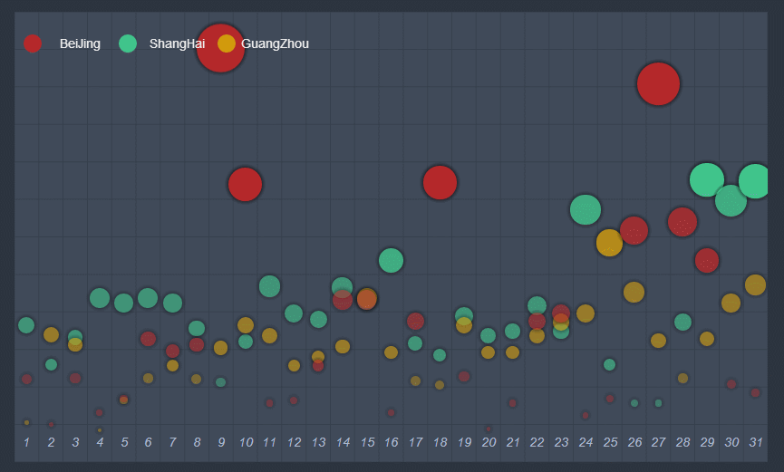
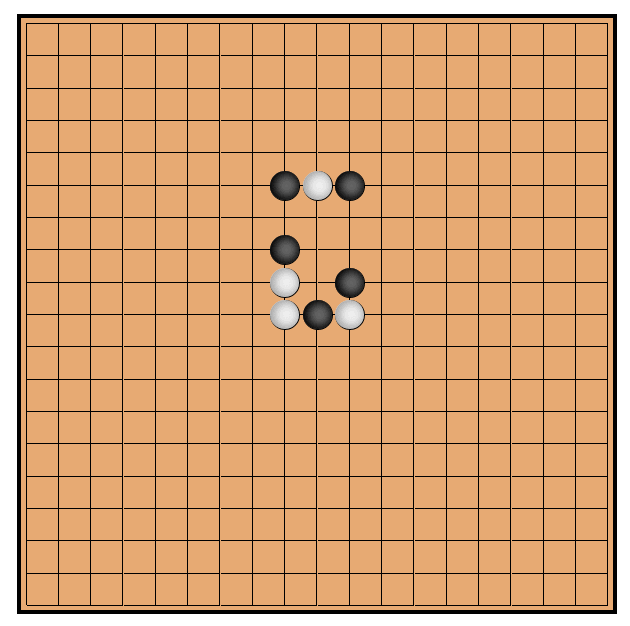
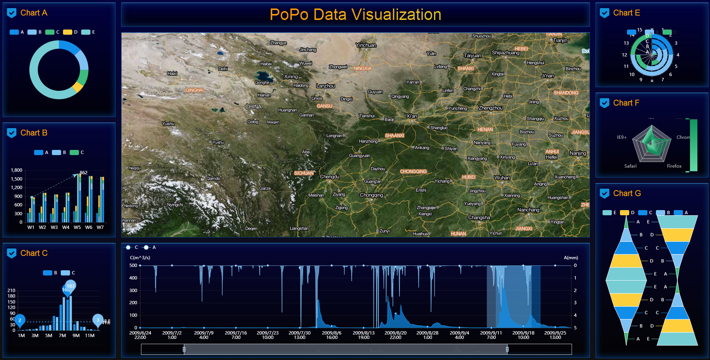

# PoPo

> JS Grid library,  but not just grid library

<div align=center>

</div>

## What's PoPo

PoPo is a two dimensional grid layout library, The rows and columns of the grid system are custom defined at runtime, no CSS dependence, supports any size screen, It is especially suitable for large screen and super large screen.PoPo adopts the double layout pattern of grid and panel, it encapsulates content independent layout code, You can quickly build any complex pages without writing any HTML or CSS code.

<div align="center">
    
    
    
    
</div>

## Features

- Custom grid system,  no CSS dependence,  no third party library dependency,  no need to write HTML,  CSS code
- Grid system uniform and free layout && Universal panel layout && User defined layout patterns, Let layout be arbitrary.
- Scaling,  positioning,  auxiliary information,  grid auxiliary line,  sub screen (coordinate) auxiliary line,  panel auxiliary line debugging function,  so that the big screen application development debugging no longer bother
- Rapid construction of visualization applications
- Adaptive multi screen
- Rich configuration,  debugging options and API
- Compatible IE9+

## [Docs](https://shunok.github.io/popo)

## Examples

- [24 rows * 24 cols](https://shunok.github.io/popo/examples/grid_24_24.html)
- [24 rows * 48 cols](https://shunok.github.io/popo/examples/grid_24_48.html)
- [Free layout](https://shunok.github.io/popo/examples/layout_complex_2.html)
- [Uniform layout](https://shunok.github.io/popo/examples/layout_avg_1.html)
- [Grids In Circle](https://shunok.github.io/popo/examples/circle.html)
- [Scatter Diagram](https://shunok.github.io/popo/examples/scatter_diagram.html)
- [City, Click the sun into night mode and click the moon into day mode](https://shunok.github.io/popo/examples/city.html)
- [Progress Data Visualization For Big Screen And Mobile](https://shunok.github.io/popo/examples/dv_average.html)
- [Data Visualization For Multi Screen](https://shunok.github.io/popo/examples/bigscreen.html)

[More Examples...](https://shunok.github.io/popo/examples/index.html)

## Install

1. node.js

```js
// npm
npm install popojs  --save

// yarn
yarn add popojs
```

2. browser

```html
<srcript src="./js/popo.min.js"></script>
```

## Use

1. node.js

```js

var P = require('popojs');

// or

import * as P from 'popojs';

// Initialize PoPo Instance
var popoInstance = P.init({
    rows: 12,
    cols: 24
});

...

// Render to container
popoInstance.addTo('container');

```

2. browser

```html
// body
...
<div id="container"></div>
...
<script>
P.init({
    container: 'container',
    rows: 12,
    cols: 24
});
</script>

```
