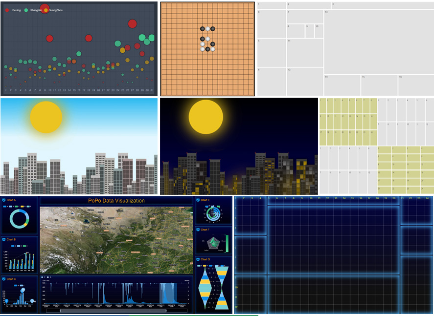

# PoPo

> Javascript 栅格布局工具

## PoPo是什么

PoPo 是一个行列二维式栅格布局工具，栅格系统的行、列数均在运行时自定义，无CSS依赖，支持任意尺寸屏幕，尤其适用于大屏幕与超大屏幕。PoPo采用栅格 + 面板双重布局模式，封装了与内容无关的布局代码，无需编写任何HTML、CSS代码，即可快速构建任意复杂页面。

<div align="center">
    
</div>

## 特性

- 自定义栅格系统，无CSS依赖，无第三方库依赖，无需编写HTML、CSS代码
- 栅格系统均匀与自由布局 + 万能的面板布局 + 用户自定义布局组合模式，让布局随心所欲
- 缩放、定位、辅助信息、栅格辅助线、分屏(坐标)辅助线、面板辅助线等调试功能，让大屏应用开发调试不再烦心
- 快速构建可视化应用
- 适配多屏
- 丰富的配置、调试选项与API
- 兼容 IE9+

## [文档与API](https://shunok.github.io/popo)

## 示例

- [24 rows * 24 cols](https://shunok.github.io/popo/examples/grid_24_24.html)
- [24 rows * 48 cols](https://shunok.github.io/popo/examples/grid_24_48.html)
- [Free layout](https://shunok.github.io/popo/examples/layout_complex_2.html)
- [Uniform layout](https://shunok.github.io/popo/examples/layout_avg_1.html)
- [Grids In Circle](https://shunok.github.io/popo/examples/circle.html)
- [Scatter Diagram](https://shunok.github.io/popo/examples/scatter_diagram.html)
- [City, Click the sun into night mode and click the moon into day mode](https://shunok.github.io/popo/examples/city.html)
- [Progress Data Visualization For Big Screen And Mobile](https://shunok.github.io/popo/examples/dv_average.html)
- [Data Visualization For Multi Screen](https://shunok.github.io/popo/examples/bigscreen.html)

[查看更多示例...](https://shunok.github.io/popo/examples/index.html)

## 安装

1. node.js

```js
// npm
npm install popojs  --save

// yarn
yarn add popojs
```

2. 浏览器环境

```html
<srcript src="./js/popo.min.js"></script>
```

## 使用

1. node.js

```js

var P = require('popojs');

// 或

// es6
import * as PoPo from 'popojs';

// 初始化实例
var popoInstance = P.init({
    rows: 12,
    cols: 24
});

...

// 添加至已渲染完成的容器中
popoInstance.addTo('container');

```

2. 浏览器端

```html
// body
...
<div id="container"></div>
...
<script>
P.init({
    container: 'container',
    rows: 12,
    cols: 24
});
</script>

```
