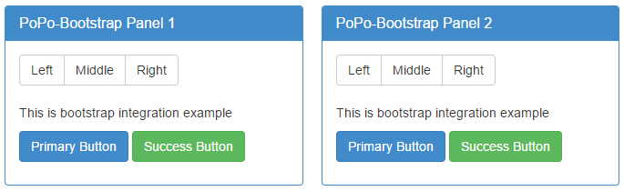

# Panel Template

The layout structure of PoPo is very suitable for component development, and provides rendering loading mechanism for panel layout (/en/panel). The component template can be defined as the following structure:

- Adds a `data-popo` attribute to the outermost `div` of the template. The attribute value is a defined alias in the `id` or Configuration`alias` of the panel.

- The second layer uses the `data-popo-target` definition, and the second layer, including the `div` itself, is rendered to the corresponding area of the panel.

```html
<div data-popo="1">
    <div data-popo-target="head">
        <!-- head content render result -->
    </div>
    <div data-popo-target="left">
        <!-- left content render result -->
    </div>
    <div data-popo-target="center">
        <!-- center content render result -->
    </div>
    <div data-popo-target="right">
        <!-- rignt content render result -->
    </div>
    <div data-popo-target="foot">
        <!-- foot content render result -->
    </div>
</div>
```

!> 1. The content must be rendered in the container mounted by the PoPo instance.

!> 2. In the instance of PoPo loading and rendering is completed, including any of the contents in the `data-popo` will be set to `data-popo` is not visible, in addition to containing `data-popo-target` attributes other than the content will be loaded and the instance is not visible.

!> 3. The `data-popo` is loaded in the order of the panel, so the upper and lower order of the defined template does not affect the final rendering result.

- [Template example Handlebars](https://shunok.github.io/popo-example/examples/bootstrap.html ":ignore")

```html
<script id="entry-template" type="text/x-handlebars-template">
    {{#each data}}
    <div data-popo="{{id}}">
        <div data-popo-target="center">
            <div class="panel panel-primary">
                <div class="panel-heading">
                    <h3 class="panel-title">{{title}}-Bootstrap Panel {{id}}</h3>
                </div>
                <div class="panel-body">
                    <div class="btn-group" role="group" aria-label="...">
                        <button type="button" class="btn btn-default">Left</button>
                        <button type="button" class="btn btn-default">Middle</button>
                        <button type="button" class="btn btn-default">Right</button>
                    </div>
                    <br><br>
                    <p>{{body}}</p>
                    <p>
                        <a class="btn btn-primary btn-mg" href="#" role="button">Primary Button</a>
                        <a class="btn btn-success btn-mg" href="#" role="button">Success Button</a>
                    </p>
                </div>
            </div>
        </div>
    </div>
    {{/each}}
</script>
```

