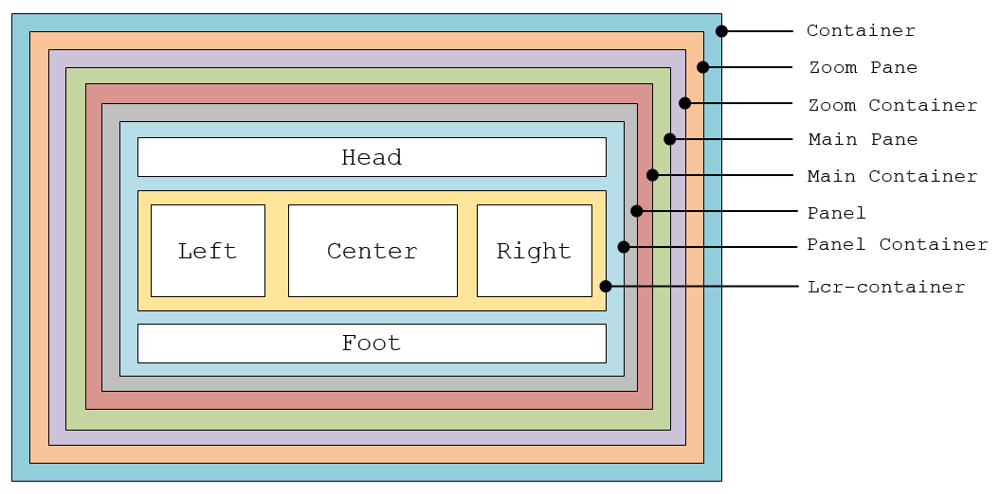
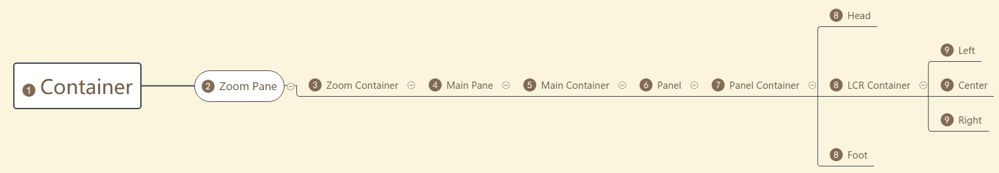

# 实例层级

一个纯净无内容的PoPo实例共有9层，面板位于第6层，创建的面板布局位于第8层和第9层，如下：

|面板名称|层级|说明|
|-|-|-|
|Container|1|实例挂载容器|
|Zoom Pane|2|缩放功能母容器|
|Zoom Container|3|缩放功能主容器|
|Main Pane|4|实例母容器|
|Main Container|5|实例主容器|
|Panel|6|面板母容器|
|Panel Container|7|面板主容器|
|Head|8|面板顶部区域主容器|
|Lcr Container|8|面板左侧、中间、右侧区域母容器|
|Foot|8|面板底部区区主容器|
|Left|9|面板左侧区主容器|
|Center|9|面板中间区主容器|
|Right|9|面板右侧区主容器|

- 层级关系示意图

- 层级关系拓朴图

