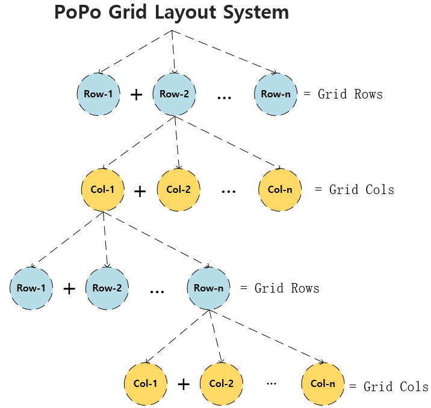
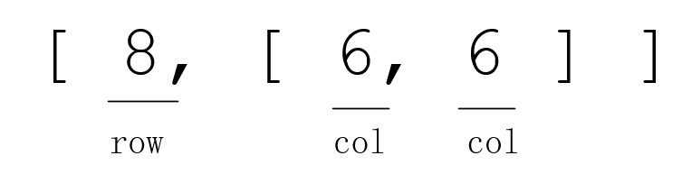
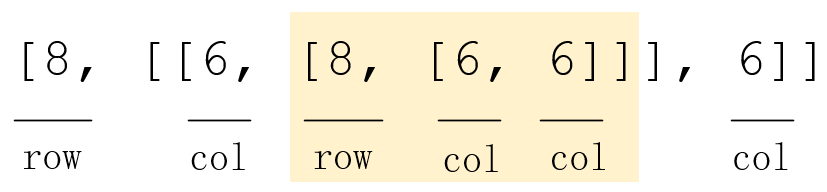
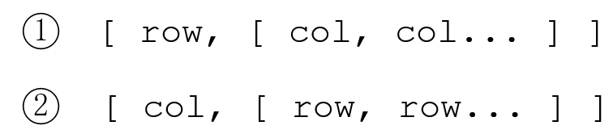
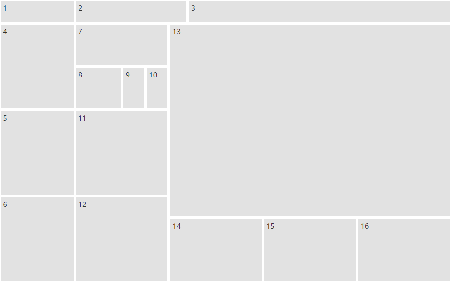

# 栅格布局

页面最终的渲染效果由样式、布局和内容共同决定，布局往往是页面开发中最先确定的地方。目前大部分主流CSS或UI框架布局使用的技术点包括：[Floats](https://developer.mozilla.org/en-US/docs/Learn/CSS/CSS_layout/Floats)、[Positioning](https://developer.mozilla.org/en-US/docs/Learn/CSS/CSS_layout/Positioning)、CSS tables、[Flexbox](https://developer.mozilla.org/en-US/docs/Learn/CSS/CSS_layout/Flexbox)、[Grid](https://developer.mozilla.org/en-US/docs/Learn/CSS/CSS_layout/Grids)，其中Grid采用行列二维方式，目前还没有正式被纳入标准。

随着前端技术在各类应用领域的深入，采用前端技术开发的应用越来越多，有相当多的应用非常适合使用行列二维式布局，如可视化大屏、指挥监控中心、桌面端程序、广告机、TV端、监控、物联网综控等应用领域，如采用一维的以列为主，需要额外配置或编译行布局。

** 有没有一种理想的布局方式，可以解决类似于上述应用开发中的布局问题：**

?> 问题 1、是否可以系统性的使用二维行列式布局替代一维布局，满足所有项目需求，有比[Grid](https://developer.mozilla.org/en-US/docs/Learn/CSS/CSS_layout/Grids) 更好的替代方案吗？

?> 问题 2、栅格系统可不可以运行时创建，而不是预先编译好?

?> 问题 3、有没有灵活度很高，而不需要借助UI定制（如DataV的拖拽式绝对定位布局）的方案？

?> 问题 4、是否可同时适配不同屏幕？

?> 问题 5、复杂布局使代码结构变得冗长且难以阅读，是否可以不用编写布局代码，让代码更易读？

基于以上五个问题，PoPo诞生了！

## 布局模型

我们先试着解析采用`bootstrap`栅格系统构建的布局，通常先从确定行`row`开始，再确定`row`中的列分布`col`，布局由`row`和`col`共同组成。以下是一个典型的栅格布局代码片断：

```html
<!-- 一个典型的boostrap栅格 -->
<div class="row">
  <div class="col-md-8"></div>
  <div class="col-md-4"></div>
</div>
```
实际往往需要嵌套更多层才能满足样式与内容的需要，布局越复杂，嵌套层就越深。

```html
<div class="row">
  <div class="col-md-8">
    <div class="row">
      <div class="col-md-6">
        ...
      </div>
      <div class="col-md-6">
        ...
      </div>
    </div>
  </div>
</div>
```

以上栅格布局结构有一个很简单的规律，即先定义行，再定义对应行的列分布，列分布中再定义行，行中再定义列分布……不断嵌套，可以一个用树图表示，如下图所示，这也是**PoPo栅格系统布局的理论模型图**。



多维数组可很好地表达上述结构，我们以下面的布局为例：
```html
<div class="row">
  <div class="col-md-6"></div>
  <div class="col-md-6"></div>
</div>
```
假设我们使用 `rows 8, cols 12` 8行12列的栅格系统，我们使用一个二维数组表达它们之间的结构与关系：


如果再嵌套一层，怎么表示呢？
```html
<div class="row">
  <div class="col-md-6">
     <div class="row">
          <div class="col-md-6"></div>
          <div class="col-md-6"></div>
     </div>
  </div>
  <div class="col-md-6"></div>
</div>
```


可以看到，再嵌套一层同样可以用数组表示，我们可以类似地嵌套多层，每嵌套一层，数组将增加两个维度。

## 布局表达式

> 最终我们将整个栅格布局的基础构成单元定义为一个二维数组，根据起始类型不同，分两种：



PoPo布局表达式有如下特征：

- 表达式数组的第一个数字如果规定其类型为`row`，如第一个表达式则表示行，与该数字同级的右侧数组表示为此行对应的列分布；

- 表达式数组的第一个数字如果规定其类型为`col`，如第二个表达式则表示列，与该数字同级的右侧数组表示为此列对应的行分布；

- 同级数组中的第一个数字之和不能超过其对应栅格类型总数量，如同级第一个数字类型为`row`，则其和不能大于栅格系统总行数，如果第一个数字类型为`col`，则其和不能大于栅格系统总列数。

表达式中的每个数字均可按此基础单元的结构定义嵌套，按照上述规则构建的数组，均为PoPo栅格系统布局表达式。

> 以`12 rows * 24 cols` 12行 * 24列栅格系统为例，以下表达式均符合要求：

```js
// 最外面一层中括号表示布局表达式集合, 以下起始类型均为row

// 一行三列，标准表达式
[[12, [8,8,8]]]

// 一行一列，标准表达式
[[12, [24]]]

// 一行一列，简写表达式
[[12]]

// 一行一列，极简表达式，仅适用最外层的简写
[12]

// 均匀3行3列共9个网格的栅格布局
[[4,[8,8,8]],[4,[8,8,8]],[4,[8,8,8]]]

// 不均匀的混合布局
[[1], [11, [[4, [4, 4, 4]], [4,[2,2,2,2,4]], 4, 4, 8]]];
[[2,[[24, [8, 4] ]]], [5, [6,12,6]],[1] ,[3,[6,6,6,6]], [1]];

```

## 自由布局

采用布局表达式(数组形式)的布局方式称为自由布局

```js
// 创建一个PoPo实例
P.init({
    container: 'container', // 挂载容器
    rows: 12, // 栅格行数
    cols: 24, // 栅格列数
    layout: [ // 布局表达式
      [1, [4, 6, 14]],
      [11, [
        [4, [4, 4, 4]],
        [5, [2, [2, [12, 6, 6]], 4, 4]],
        [15, [9, [3, [8, 8, 8]]]],]
      ]
    ]
});
```

生成的自由布局效果图：


## 均匀布局

均匀布局指栅格布局生成的[面板](/zh-cn/panel.md)(格子单元)宽高均一致，PoPo提供了更便捷的方式定义均匀布局

```js
// 创建一个PoPo实例
P.init({
    container: 'container', // 挂载容器
    rows: 12, // 栅格行数
    cols: 24, // 栅格列数
    layout: { // 布局配置
      cols: 4,  // 纵向的面板数量
      rows: 3  // 横向的面板数量
    },
});

```

生成的均匀布局效果图：
